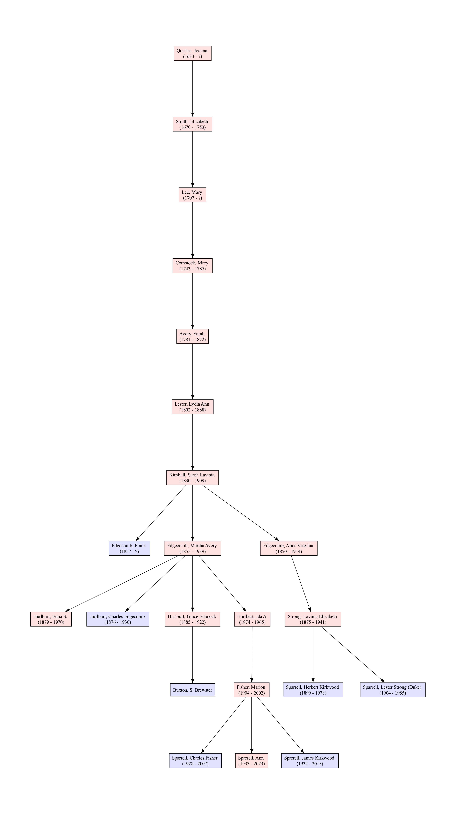

= Table of Figures

== Vol_01

show images or just links

.image:ancestors.svg[basic]

.image:04_hybrid_graph.svg[Hybrid Graph wo dups] 

.image:Vol01.DNA/2sparrellYgeneNotLiving.png[Y-Chromosone]

.

== Vol_02 Ships

Mayflower
* link:

Anne

Fortune

Mary and John

Wintrhop Fleet

== Vol_03 Anecdotes

== Vol_04 Military

== Vol_05 Towns

Duxbury

Hartford

Newbury

Scituate

== Vol 06 Societies

Avery

Chesebrough

Colonial Wars

Dummings

DAR/SAR

Flagon and Trencher

Leonard

Mayflower

Minor

Palmer

Stetson

Strong

Wintrop

== Volume 07 Fun Fact Cousins

=== Presidents and Politicians

== Entertainment

== Literary

== Music