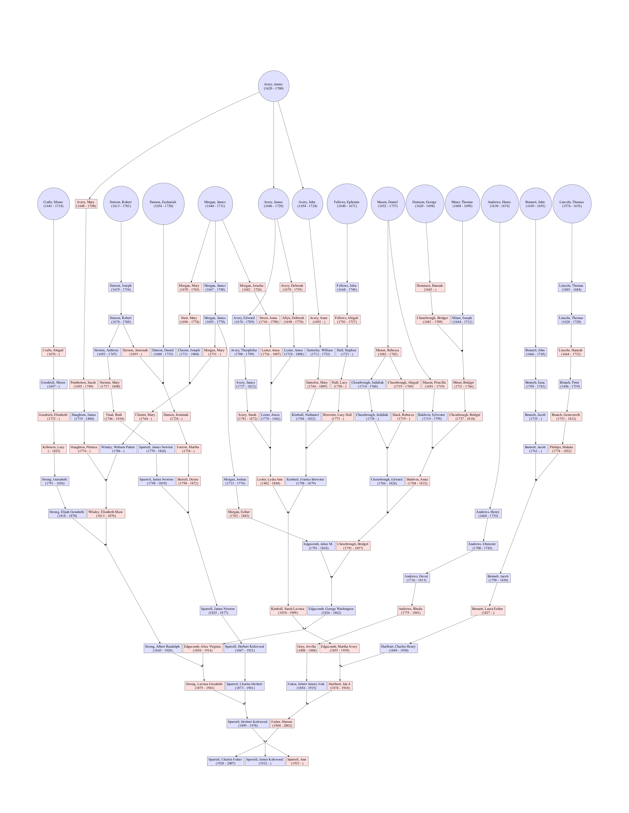

# King Phillp's War
King Philip’s War was a brutal conflict in New England (mainly 1675–1676, tapering off to 1678 in Maine) between several Indigenous nations and English colonists with their Native allies. 
Some consider it the deadliest (per capita) US war.

14 ancestors fought in this war:

* need to list the 14 with links to their pages
* ...

